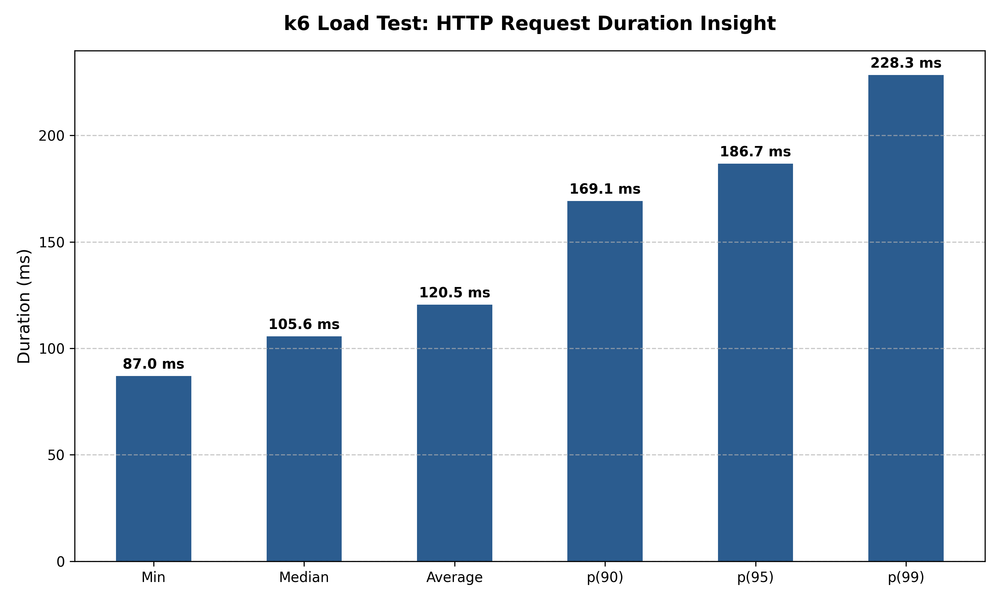
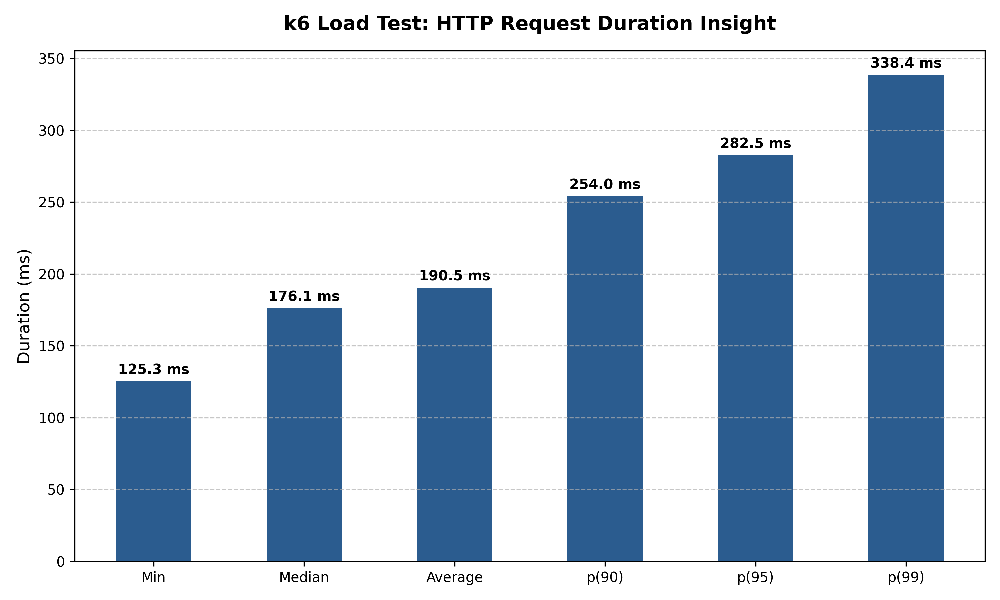
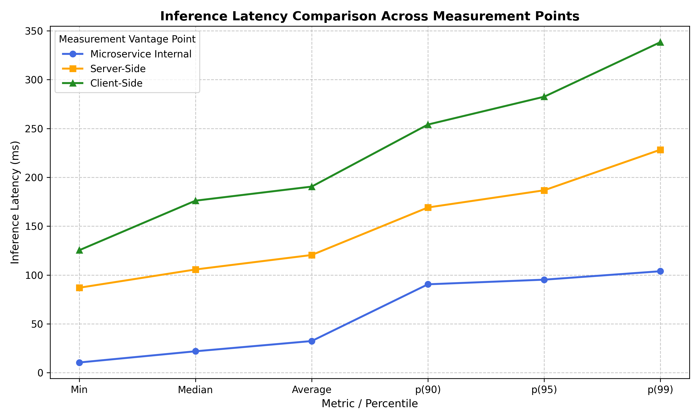

# EdgeNodeLight

- [ Keras model packing ](Inference/Model/modelv3.py)
- [ Transformer python codebased ](Inference/Transformer/Transformer_optimized_glocery.py)
- [ Transformer yaml deployment ](Inference/Transformer/Transformer_optimized.yaml)
- [ k6 test](Inference/Transformer/loader.js)
    - [ Inference remote results](Inference/Transformer/results.txt)
    - [ Inference cluster side results](Inference/Transformer/results_local.txt)
-------------------------------------------------------------------------------------------------
- [ OOD detector python codebased ](Drift/driftv6.py)
- [ OOD detector yaml deployment ](Drift/simple_model_OOD.yaml)
-------------------------------------------------------------------------------------------------
```bash
NAME                                                          READY   STATUS    RESTARTS   AGE   IP           NODE
ood-detector-simple-cnn-00001-deployment-7bf945ff96-bxzlk     3/3     Running   0          15s   10.42.1.217  tconti-mscthesis-a.mmwunibo.it
ood-detector-simple-cnn-test-00001-deployment-8bd77588d-k8b87 3/3     Running   0          15s   10.42.1.218  tconti-mscthesis-a.mmwunibo.it
simple-cnn-predictor-00001-deployment-75b97546d-8jk9x         3/3     Running   0          19h   10.42.3.234  nvidia-ca7
simple-cnn-test-predictor-00001-deployment-5b9b4fdb5-4c69r    3/3     Running   0          19h   10.42.3.235  nvidia-ca7
```
-------------------------------------------------------------------------------------------------
## Inference microservice internal latency
- pre-processing
- post-processing
- prediction

[ PNG PLOT LINK  ](Inference/Transformer/internal_latency.png)
<p align="center">
  
</p>

-------------------------------------------------------------------------------------------------

## Cloud side http latency req metrics

<p align="center">
  
</p>

-------------------------------------------------------------------------------------------------

## Client side http latency req metrics

<p align="center">
  
</p>

-------------------------------------------------------------------------------------------------

## Latency comparison

<p align="center">
  
</p>

---------------------------------------------------------------------------------------------------
## Consideration 

During the testing phase, the MEC Kubernetes plug-in architecture did not show clear performance improvements when using KServe without the serverless architecture. This is mainly due to the small and limited testing environment, which may not be large enough to show the advantages of the different networking architecture. The following KServe configuration was used:

```yaml
annotations:
    serving.kserve.io/deploymentMode: RawDeployment
    sidecar.istio.io/inject: "false"
```
Also the isolation of the others service Pods from the nvidia node didn't show performance improvements.

Using FP16 instead of FP32 also did not show significant improvements. This is probably because the models used for testing are small.

Running and testing only one model results in a slightly lower latency than running two models on the same GPU, but the difference is small. This may be due to some contention (locks) when multiple models access to the GPU.

### Possible Performance Improvements:

1. Network bypass: Reduce the network overhead by allowing process to access directly to the network buffers, bypassing part of the operating system and hypervisor network stack. This approach is less secure but can be suitable for a closed architecture. An example is the [INSANE project](https://github.com/MMw-Unibo/INSANE).

2. Pipeline optimization

3. Better runtime: Test a more efficient inference runtime that can make better use of the GPU and reduce the overhead and latency of GPU access.