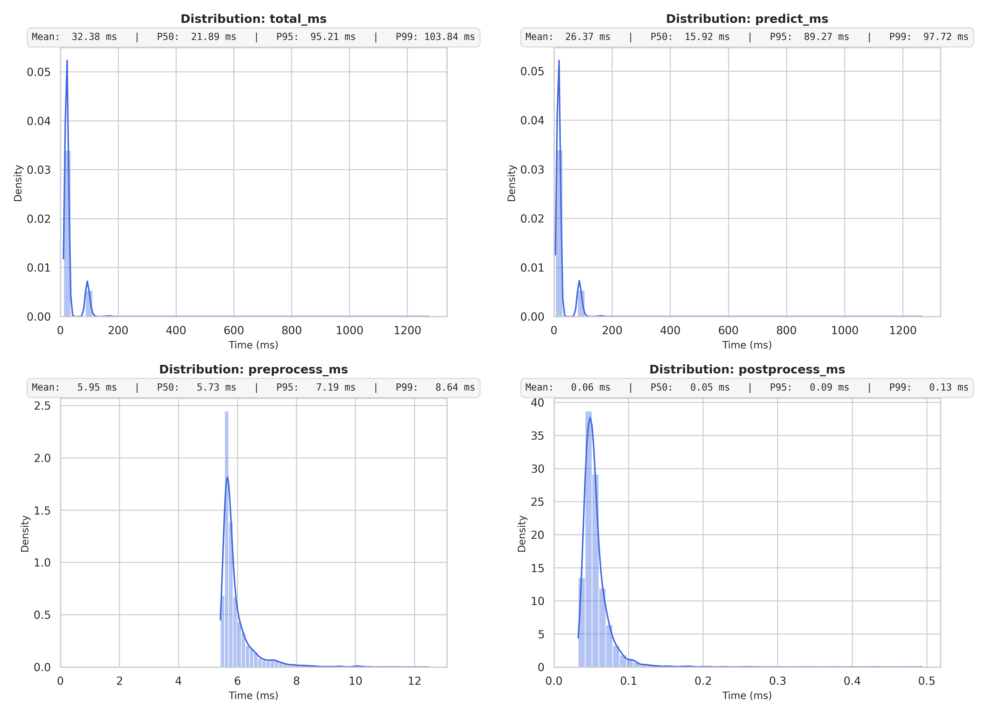

# EdgeNodeLight

- [ Keras model packing ](Inference/Model/modelv3.py)
- [ Transformer python codebased ](Inference/Transformer/Transformer_optimized_glocery.py)
- [ Transformer yaml deployment ](Inference/Transformer/Transformer_optimized.yaml)
- [ k6 test](Inference/Transformer/loader.js)
    - [ Inference remote results](Inference/Transformer/results.txt)
    - [ Inference cluster side results](Inference/Transformer/results_local.txt)
-------------------------------------------------------------------------------------------------
- [ OOD detector python codebased ](Drift/driftv6.py)
- [ OOD detector yaml deployment ](Drift/simple_model_OOD.yaml)
-------------------------------------------------------------------------------------------------
```bash
NAME                                                          READY   STATUS    RESTARTS   AGE   IP           NODE
ood-detector-simple-cnn-00001-deployment-7bf945ff96-bxzlk     3/3     Running   0          15s   10.42.1.217  tconti-mscthesis-a.mmwunibo.it
ood-detector-simple-cnn-test-00001-deployment-8bd77588d-k8b87 3/3     Running   0          15s   10.42.1.218  tconti-mscthesis-a.mmwunibo.it
simple-cnn-predictor-00001-deployment-75b97546d-8jk9x         3/3     Running   0          19h   10.42.3.234  nvidia-ca7
simple-cnn-test-predictor-00001-deployment-5b9b4fdb5-4c69r    3/3     Running   0          19h   10.42.3.235  nvidia-ca7
```
-------------------------------------------------------------------------------------------------
Inference microservice internal latency
- pre-processing
- post-processing
- prediction

<p align="center">
  
</p>
