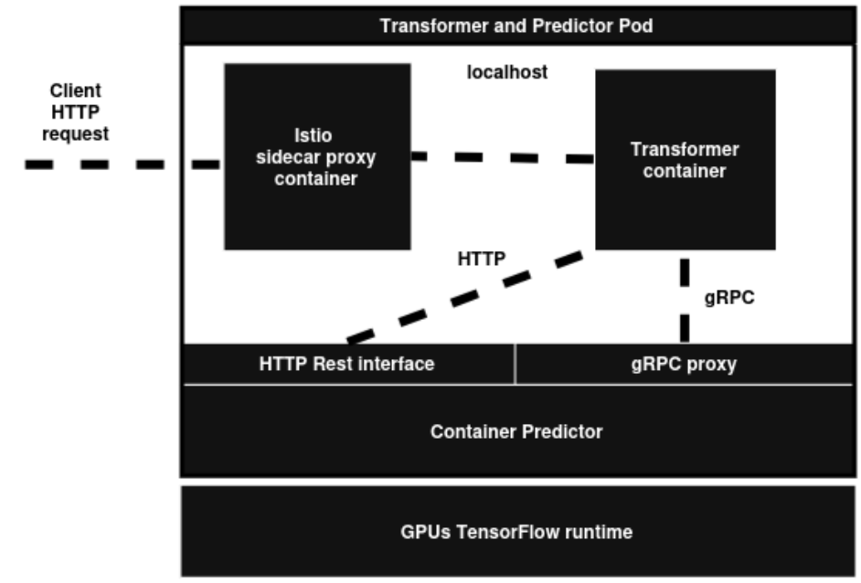
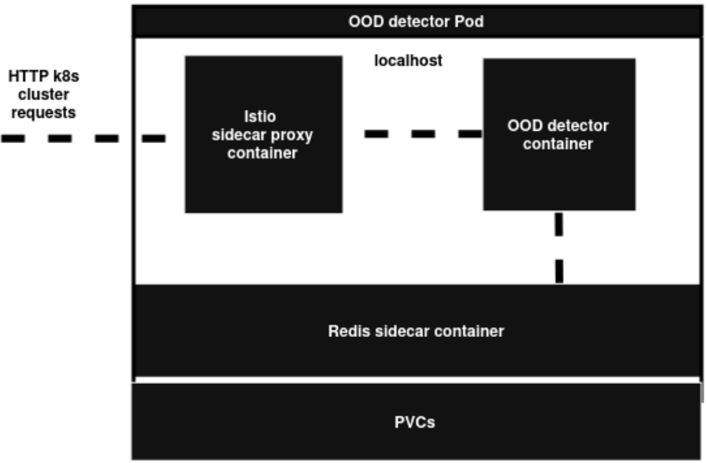
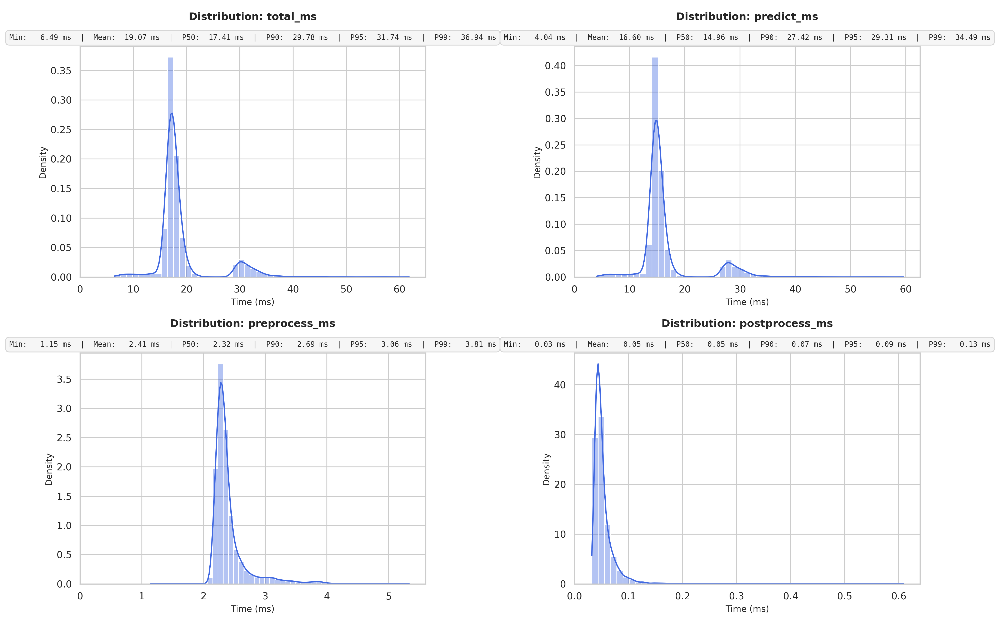

# EdgeNodeLight

-------------------------------------------------------------------------------------------------
- [ Keras model packing ](Inference/Model/modelv3.py)
- [ Transformer python codebased ](Inference/Transformer/Transformer_optimized_glocery.py)
- [ Transformer yaml deployment ](Inference/Transformer/Transformer_optimized.yaml)
- [ k6 test](Inference/Transformer/loader.js)
    - [ Inference remote results](Inference/Transformer/results.txt)
    - [ Inference cluster side results](Inference/Transformer/results_local.txt)
-------------------------------------------------------------------------------------------------
- [ OOD detector python codebased ](Drift/driftv6.py)
- [ OOD detector yaml deployment ](Drift/simple_model_OOD.yaml)
-------------------------------------------------------------------------------------------------

Cluster configuration:

```bash

kubectl get pods
NAME                                                          READY   STATUS    RESTARTS   AGE   IP           NODE
ood-detector-simple-cnn-00001-deployment-7bf945ff96-bxzlk     3/3     Running   0          15s   10.42.1.217  tconti-mscthesis-a.mmwunibo.it
ood-detector-simple-cnn-test-00001-deployment-8bd77588d-k8b87 3/3     Running   0          15s   10.42.1.218  tconti-mscthesis-a.mmwunibo.it
simple-cnn-predictor-00001-deployment-75b97546d-8jk9x         3/3     Running   0          19h   10.42.3.234  nvidia-ca7
simple-cnn-test-predictor-00001-deployment-5b9b4fdb5-4c69r    3/3     Running   0          19h   10.42.3.235  nvidia-ca7

```

OOD detector redis logging results after a high-throughput inference test phase:

- metrics:redis_success_ops: Tracks the total number of image assets successfully ingested and stored in Redis with an active time-to-live.
- metrics:redis_success_ttl: Counts the number of times image expiration windows were successfully extended upon confirming that an incoming vector was a ood.
- metrics:ood_forwarded_total: Measures the total number of odd data points successfully packaged, transmitted and acknowledged by the downstream data lake forwarding endpoint.
- metrics:ood_dropped_missing_image: Records the number of drifted samples that could not be persisted because the associated image data failed to appear in Redis within the retry window (redirected to a Dead Letter Queue).
- metrics:redis_errors: Captures any communication or operational failures encountered while interacting with the Redis backend during runtime.

The system has been configured with out a data lake connection for the ood sample, so there is a fallback ack policy that simulate the cloud storage operation.

```bash

kubectl exec ood-detector-simple-cnn-test-00001-deployment-5b58d58789-jrq79 -c redis -- redis-cli mget metrics:redis_success_ops metrics:redis_success_ttl metrics:ood_forwarded_total metrics:ood_dropped_missing_image metrics:redis_errors
3453
3453
3591

kubectl exec ood-detector-simple-cnn-00001-deployment-6645f444b5-hf7p6 -c redis -- redis-cli mget metrics:redis_success_ops metrics:redis_success_ttl metrics:ood_forwarded_total metrics:ood_dropped_missing_image metrics:redis_errors
3467
3467
3825


```

-------------------------------------------------------------------------------------------------

## Transformer microservice architecture

<p align="center">
  
</p>

-------------------------------------------------------------------------------------------------

## Detector microservice architecture

<p align="center">
  
</p>


-------------------------------------------------------------------------------------------------
## Inference microservice internal latency

- pre-processing
- post-processing
- prediction

[ PNG PLOT LINK  ](Inference/Transformer/internal_latency3.png)
<p align="center">
  
</p>

-------------------------------------------------------------------------------------------------

<!-- 
## Cloud side http latency req metrics

<p align="center">
  
</p>

-------------------------------------------------------------------------------------------------

## Client side http latency req metrics

<p align="center">
  
</p>

-------------------------------------------------------------------------------------------------
-->
## Latency comparison

<p align="center">
  
</p>

---------------------------------------------------------------------------------------------------
## Consideration 

During the testing phase, the MEC Kubernetes plug-in architecture did not show clear performance improvements when using KServe without the serverless architecture. This is mainly due to the small and limited testing environment, which may not be large enough to show the advantages of the different networking architecture. The following KServe configuration was used:

```yaml
annotations:
    serving.kserve.io/deploymentMode: RawDeployment
    sidecar.istio.io/inject: "false"
```
Also the isolation of the others service Pods from the nvidia node didn't show performance improvements.

Using FP16 instead of FP32 also did not show significant improvements. This is probably because the models used for testing are small.

Running and testing only one model results in a slightly lower latency than running two models on the same GPU, but the difference is small. This may be due to some contention (locks) when multiple models access to the GPU.

### Possible Performance Improvements:

1. Network bypass: Reduce the network overhead by allowing process to access directly to the network buffers, bypassing part of the operating system and hypervisor network stack. This approach is less secure but can be suitable for a closed architecture. An example is the [INSANE project](https://github.com/MMw-Unibo/INSANE).

2. Pipeline optimization

3. Better runtime: Test a more efficient inference runtime that can make better use of the GPU and reduce the overhead and latency of GPU access.